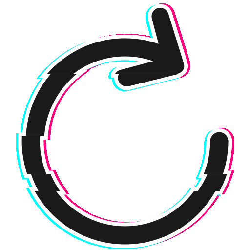

    

<em>Founded in 2023 — driven by an insatiable curiosity and an unyielding passion for cybersecurity</em>

---

## About Us
Reset Security is a collaborative **CTF and cybersecurity team** dedicated to:
- Vulnerability research & exploit development  
- Capture The Flag (CTF) competitions  
- Security tooling & automation  
- Knowledge sharing and community growth  

We focus on **continuous learning, innovation, and pushing the boundaries of security research**.

---

## Links
- 🌐 [Website](https://resetsec.xyz/)
- 💼 [LinkedIn](https://www.linkedin.com/company/resetsec)
- 🐦 [X / Twitter](https://twitter.com/ResetSecz)
- 🏆 [CTFtime](https://ctftime.org/team/12345)
---

## Contact Us
📧 <a href="mailto:administration@resetsec.xyz">administration@resetsec.xyz</a>

---

<pre>                                                                                                                                  
  ____                _     ____                       _ _         
 |  _ \ ___  ___  ___| |_  / ___|  ___  ___ _   _ _ __(_) |_ _   _ 
 | |_) / _ \/ __|/ _ \ __| \___ \ / _ \/ __| | | | '__| | __| | | |
 |  _ <  __/\__ \  __/ |_   ___) |  __/ (__| |_| | |  | | |_| |_| |
 |_| \_\___||___/\___|\__| |____/ \___|\___|\__,_|_|  |_|\__|\__, |
                                                             |___/ 
 
 </pre>

    <em>“Securing the future, one vulnerability at a time”</em>

